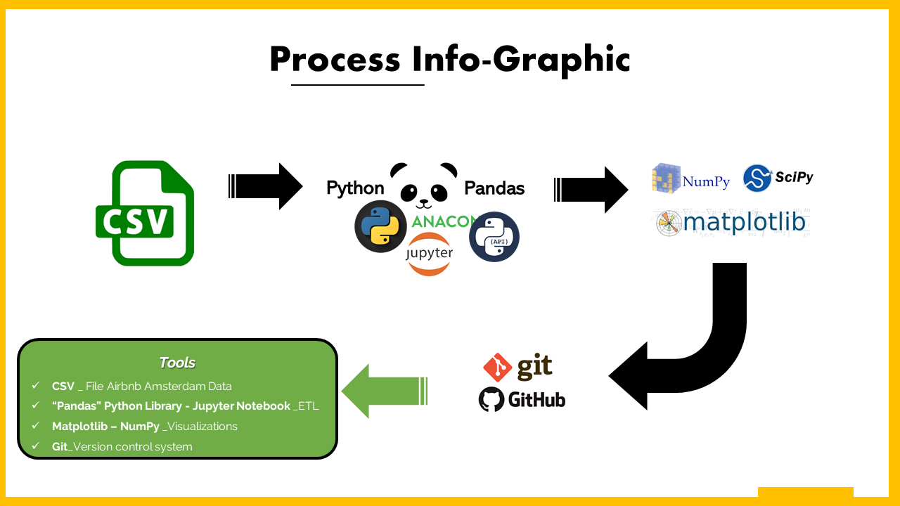

Please visit our project site xxxxxx

# Project Description

The Amsterdam AirBnB Dataset contains data about AirBnB listings in Amsterdam, calendar availability for each of these listings as well as user reviews on the listings. Using this dataset, In the following analysis, we explore Amsterdam’s Airbnb Market in 2018 – 2019 to give resources to tourist at the time of decision making. We are going to attempt to answer the following business questions.

## Pricing Trends

* How does pricing increase or decrease by season and what is the peak season in Amsterdam?
* How does pricing increase or decrease by neighborhood and which ones are the priciest neighborhoods in Amsterdam?
* How does property types within neighborhoods impact price for the most expensive neighborhoods and most common property types?

xxxxxxxxxxxxxxxx
* Is there a Trend in Location?------
* What are the average reviews?-----
* What is the volume of Rent between Seasons?-----

# Analysis Steps

We search on kaggle for dasets availables related to comsumer products or tourism and found the following two opcion: 

 * https://www.kaggle.com/aungpyaeap/supermarket-sales
 * https://www.kaggle.com/erikbruin/airbnb-amsterdam?select=reviews_details.csv
After a team analysis we decide to work on Airbnb data (tourism), because this fit very with the requiment.

## Extract data
We used Pandas [.ipynb Jupyter Notebook] to extract the data FROM CSV files.

## Transform

## Load
We decided to load the data into a mongoDB because It is flexible schema makes it easy to evolve and store data in a way that is easy for programmers to work with. MongoDB is also built to scale up quickly and supports all the main features of modern databases such as transactions. 

### Why Use MongoDB and When to Use It?
* https://www.mongodb.com/why-use-mongodb

## Sources

* https://www.kaggle.com/erikbruin/airbnb-amsterdam?select=reviews_details.csv
* https://news.airbnb.com/wp-content/uploads/sites/4/2021/05/Airbnb-Report-on-Travel-Living.pdf
